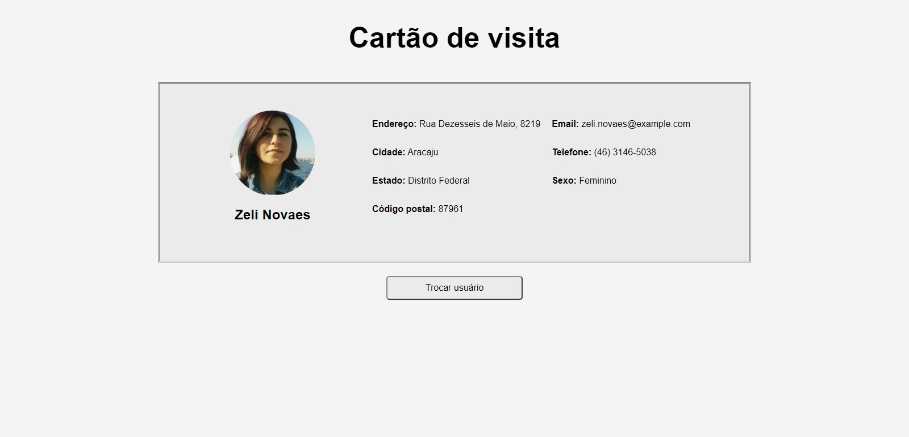

<h1 align="center">
  Cartão de Visita
</h1>

 

  

 

## **Sobre o projeto**

#### Página de um cartão de visitas.

- Site desenvolvido consumindo dados da api <a href="https://randomuser.me/">Random User</a>, que fornece informações de usuários fictícios.

- Quando o botão "Trocar Usuário" é clicado, é feita uma nova requisição e a api traz outro usuário.

## **Tecnologias utilizadas**

