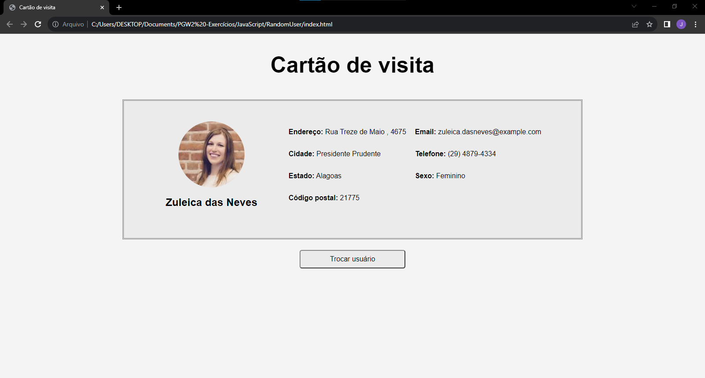

# Cartao-de-visita
Página responsiva desenvolvida utilizando HTML5, CSS3, JavaScript e consumindo dados da API RandomUser 

A página traz cartões de visitas contendo as principais informações de usuários aleatórios.

